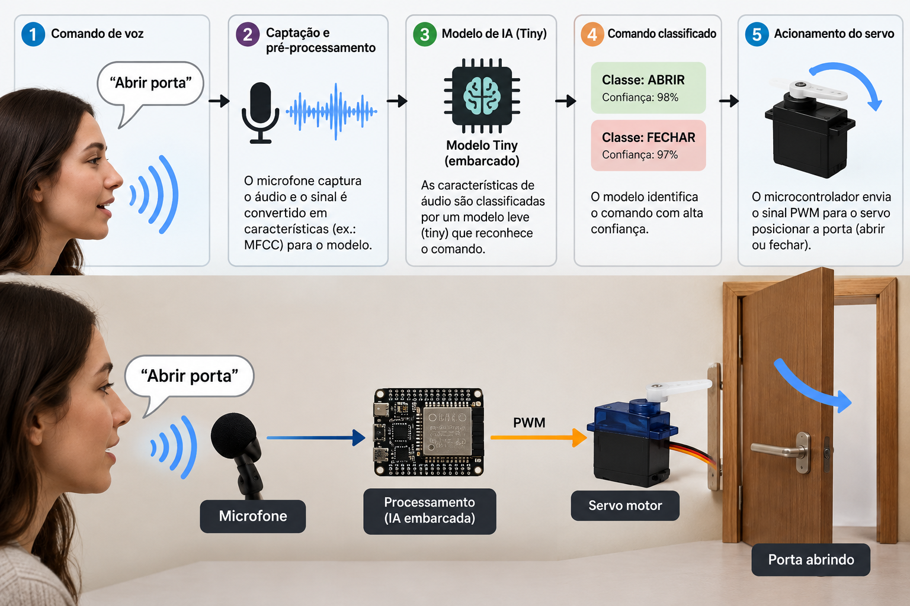
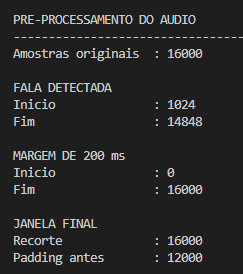
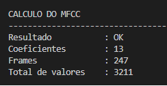
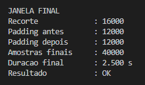
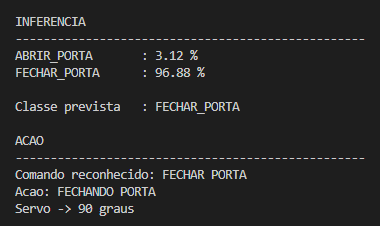
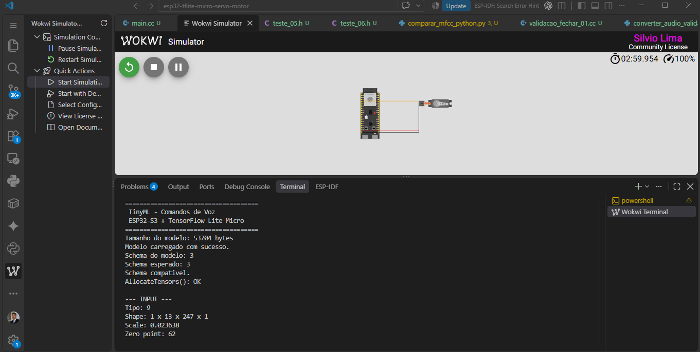
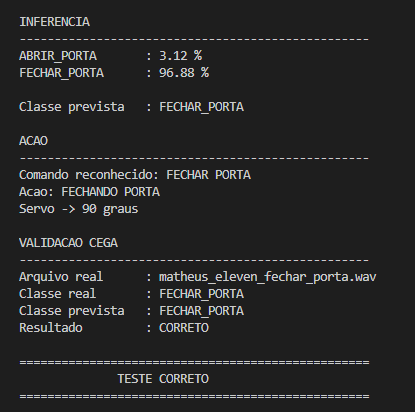
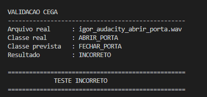
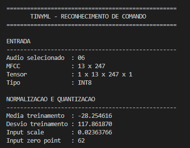

# TinyML - Reconhecimento de Comandos de Voz com ESP32-S3



Este projeto implementa um sistema embarcado de reconhecimento de comandos de voz usando um microcontrolador ESP32-S3, TensorFlow Lite Micro e um servo motor. O objetivo é classificar comandos como `ABRIR_PORTA` e `FECHAR_PORTA` a partir de áudio, processar os dados em tempo real e acionar um mecanismo mecânico em resposta à inferência.

O sistema combina:
- captura e pré-processamento de áudio;
- extração de features MFCC;
- rede neural convolucional em formato TFLite;
- execução em hardware embarcado;
- acionamento de um servo motor para abrir ou fechar uma porta simulada.


## Visão geral do sistema

A solução foi desenvolvida para demonstrar o uso de TinyML em dispositivos microcontrolados, aproveitando o baixo custo computacional e a eficiência do ESP32-S3. O fluxo principal é:

1. O usuário seleciona um áudio de teste pelo terminal serial.
2. O sinal de áudio é processado para remover ruído e isolar a fala.
3. O algoritmo calcula coeficientes MFCC.
4. O modelo TinyML classifica o comando.
5. O resultado é comparado com a classe real.
6. O servo motor executa a ação correspondente.

## Arquitetura



O projeto está organizado em módulos que separaram os principais blocos:
- `main/` — código principal do firmware e integração com o modelo;
- `main/model/` — modelo TensorFlow Lite exportado para o microcontrolador;
- `main/audio/` — arquivos de áudio, preprocessing e cálculo de MFCC;
- `NOTEBOOKS/` — notebooks para treinamento e validação do modelo;
- `IMG/` — imagens de apoio para documentação e análise;
- `converter_audio.py`, `preparar_audio_teste.py` e scripts de validação — ferramentas para preparação dos dados.

## Função principal

O firmware principal (`main/main.cc`) realiza as etapas seguintes:

- carrega o modelo TFLite;
- aloca o tensor arena necessário;
- prepara a entrada do modelo com dados normalizados e quantizados;
- executa a inferência;
- interpreta a saída como probabilidade de abrir ou fechar a porta;
- aciona o servo motor conforme a classe prevista;
- mostra o resultado da classificação no terminal serial.

A lógica de decisão é simples e direta:

- se `FECHAR_PORTA` tem probabilidade maior ou igual a 50%, o servo fecha a porta;
- caso contrário, o servo abre a porta.

## Pré-processamento e MFCC

A etapa de extração de características é essencial para o bom desempenho do modelo. O sinal é recortado para capturar apenas a parte relevante da fala e a sequência de coeficientes MFCC é convertida em um tensor de entrada para a rede.





Os arquivos de áudio utilizados para validação e testes são armazenados no diretório `main/audio/`, e o processamento é feito em C/C++ para manter a execução leve e compatível com o ESP32-S3.

## Inferência no ESP32-S3

O modelo é executado em formato quantizado INT8, tornando a inferência viável em hardware restrito. Isso reduz o consumo de memória e aumenta a velocidade de processamento, permitindo que o microcontrolador execute a rede neural localmente.





## Resultados esperados

O projeto foi validado com diferentes gravações de voz para autenticar os comandos:
- `ABRIR_PORTA`
- `FECHAR_PORTA`

Além da lógica de inferência, o sistema exibe no terminal os valores das probabilidades e confirma se a previsão corresponde à classe correta do áudio testado.





## Estrutura do repositório

```text
.
├── IMG/
│   ├── Amostras_mfcc.png
│   ├── Calculo_mfcc.png
│   ├── Escolher_audio_teste.png
│   ├── INFERENCIA.png
│   ├── Modelo_ok.png
│   ├── Pre-processamento.png
│   ├── Pre-processamento_2.png
│   ├── TESTE_AUDIO_05.png
│   ├── TESTE_AUDIO_06.png
│   └── TINYML.png
├── NOTEBOOKS/
│   └── notebooks de treinamento / validação
├── main/
│   ├── audio/
│   ├── model/
│   ├── CMakeLists.txt
│   ├── idf_component.yml
│   ├── main.cc
│   ├── servo_motor.cc
│   └── servo_motor.h
├── converter_audio.py
├── converter_audio_validacao.py
├── preparar_audio_teste.py
├── validar_audio_int8.py
├── diagram.json
├── CMakeLists.txt
├── sdkconfig
├── RECONHECIMENTO_COMANDO_VOZ.png
├── "Resultado da Classificação.png"
├── README.md
└── wokwi.toml
```

## Requisitos

Para compilar e executar este projeto, você precisará de:
- ESP32-S3
- ESP-IDF instalado e configurado
- Toolchain do ESP-IDF no PATH
- Cabo USB para conexão serial
- Dependências do componente `esp-tflite-micro` e `esp-dsp`

## Build e execução

1. Abra o projeto no diretório raiz.
2. Configure a target do ESP-IDF para o ESP32-S3:

```bash
idf.py set-target esp32s3
```

3. Compile o firmware:

```bash
idf.py build
```

4. Faça o upload para a placa:

```bash
idf.py -p /dev/ttyUSB0 flash
```

5. Monitore a saída serial:

```bash
idf.py -p /dev/ttyUSB0 monitor
```

6. Escolha um comando de áudio no menu e observe a classificação e o acionamento do servo.

## Treinamento do modelo

A parte de treinamento foi desenvolvida em notebooks localizados em `NOTEBOOKS/`. Esses arquivos mostram:
- preparação dos dados de áudio;
- extração de MFCC;
- treinamento da rede em um ambiente Python/Colab;
- conversão do modelo para formato TFLite e quantização INT8.

O processo resultou em um modelo compactado adequado para inferência embarcada em microcontroladores.

## Caso de uso

Este projeto pode ser usado como base para:
- sistemas de automação residencial;
- controle de dispositivos por voz;
- protótipos de interfaces assistivas;
- aplicações educacionais em TinyML e Edge AI.



## Licença

Este repositório foi desenvolvido para fins acadêmicos e de demonstração. O projeto utiliza componentes do ecossistema ESP-IDF, TensorFlow Lite Micro e bibliotecas do Espressif.

## Observações finais

A combinação de processamento de voz, redes neurais leves e hardware embarcado demonstra como é possível trazer inteligência artificial para dispositivos de baixo custo e baixa potência. Este repositório serve como referência prática para aplicações de reconhecimento de comandos por voz em microcontroladores ESP32.

--- 
